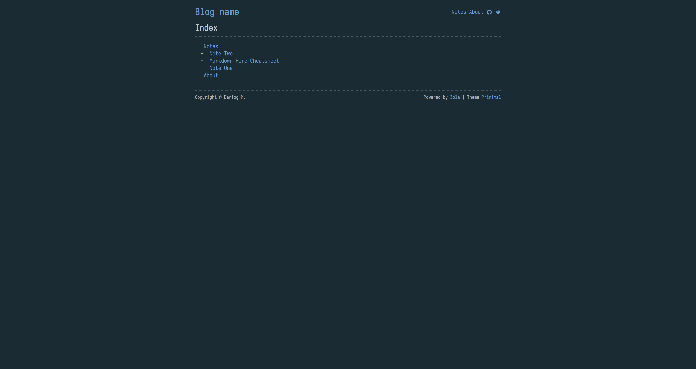
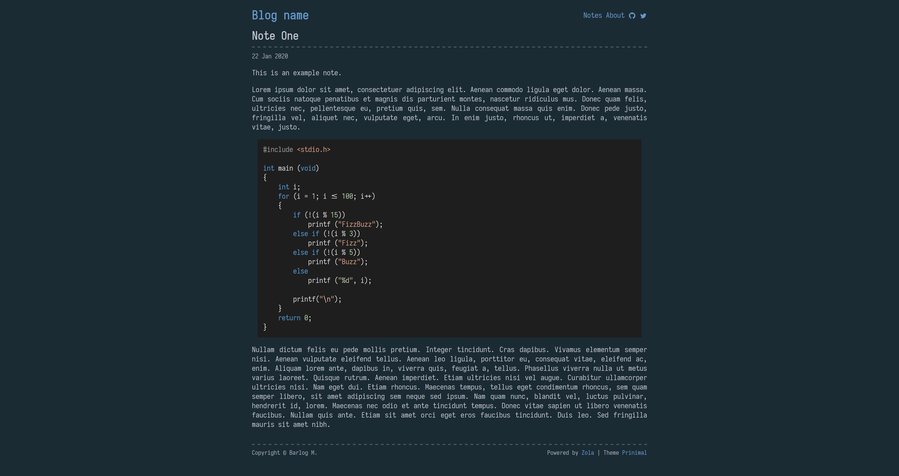

# Oceanic Zen

Oceanic Zen is a theme for [Zola](https://www.getzola.org/) static site generator

Oceanic Zen is a minimalistic theme for personal blog.




## Installation

Download theme to your `themes` directory:

```bash
$ cd themes
$ git clone https://github.com/barlog-m/oceanic-zen.git
```

Enable it in your `config.toml`:

```toml
theme = "oceanic-zen"
```

## Options

Theme supported some extra options

```toml
[extra]
author = "blog author name"
github = "github author name"
twitter = "twitter author name"
```

Font [Iosevka](https://typeof.net/Iosevka/)
